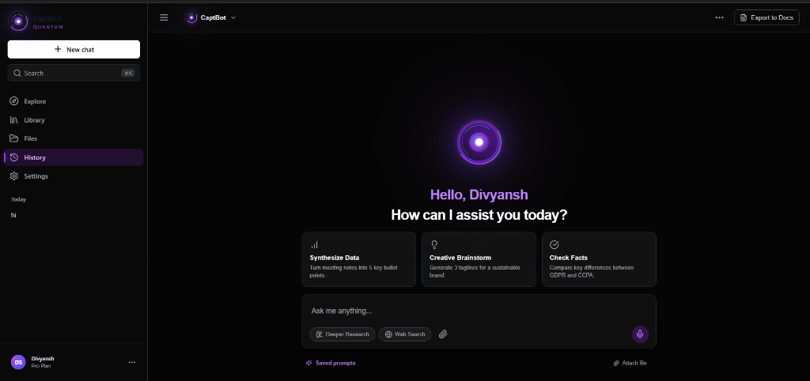
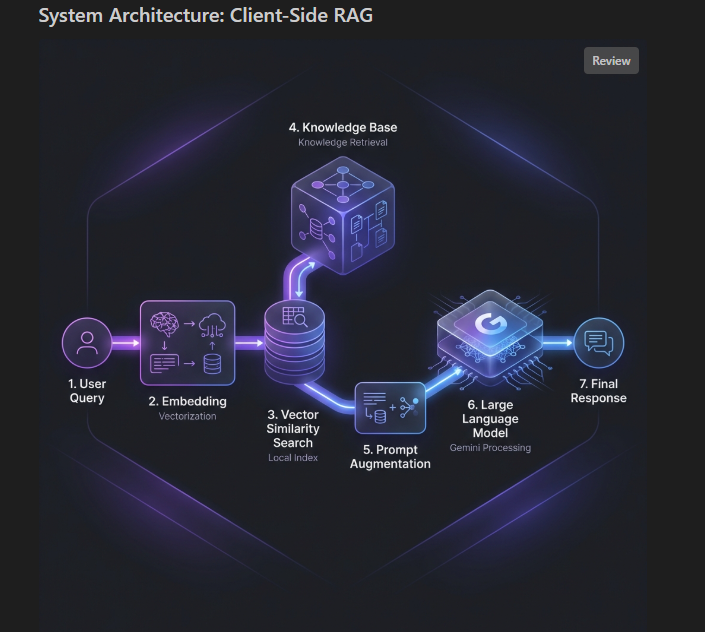
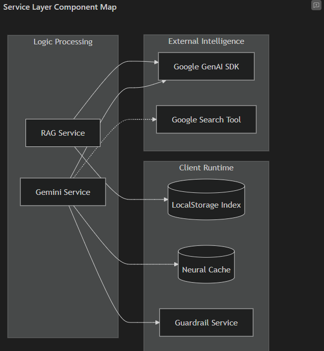
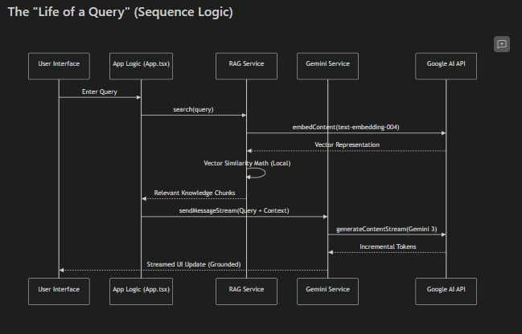
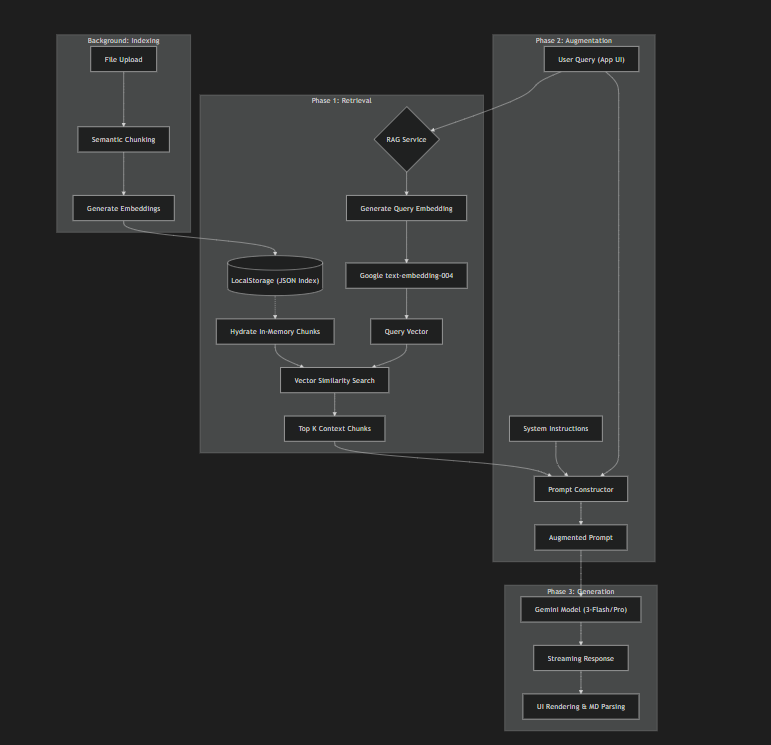

# CaptBot: Quantum-Grade AI Orchestration



CaptBot is a high-performance, client-side Retrieval-Augmented Generation (RAG) platform built on Google's Gemini 1.5 ecosystem. It combines lightning-fast local vector indexing with advanced LLM reasoning to provide a secure, private, and powerful research assistant.

## 🌌 System Architecture

CaptBot leverages a multi-phase architectural flow designed for low latency and high relevance.

### 1. Macro Conceptual Overview

A high-level view of how user queries move from vectorization to final grounded response.

### 2. Service Layer Component Map

Detailed layout of the internal services, showing the interplay between the Gemini SDK, RAG engine, and local storage persistence.

### 3. The "Life of a Query" (Sequence Logic)

A granular look at the synchronous and asynchronous calls that happen between the UI, the RAG service, and the Google AI APIs.

### 4. Technical Data Flow (RAG Pipeline)

Deep dive into the Semantic Chunking, Local Similarity Search, and Context Injection phases.

---

## 🚀 Key Features

- **⚡ Low Latency Architecture**: Optimized for high-speed processing, ensuring near-instantaneous query-to-response cycles.
- **🛡️ Integrated Guardrails**: Built-in `GuardrailService` that enforces safety, prevents prompt injection, and manages input complexity in real-time.
- **Local Vector Engine**: Sub-millisecond similarity search using in-memory cosine math.
- **Deeper Research Mode**: Intelligent task decomposition with a dedicated "Thinking Budget."
- **Multi-Modal Support**: Native handling of image and file attachments for contextual analysis.
- **Dynamic Charting**: Automatic parsing of data into interactive, premium visualizations.
- **Privacy-First**: Knowledge indices are stored strictly in your browser's `LocalStorage`.

## 🛠️ Technical Stack

- **Core**: Vite + React + TypeScript
- **AI Ecosystem**: Google Generative AI (Gemini 1.5 Flash/Pro)
- **Vector Search**: Custom client-side Cosine Similarity Engine
- **Animations**: Framer Motion
- **Styling**: Tailwind CSS (Premium Dark Mode Aesthetic)

---

## ⚡ Quick Start

### 1. Prerequisites
Ensure you have a valid [Google AI Studio API Key](https://aistudio.google.com/).

### 2. Local Setup
```bash
# Install dependencies
npm install --legacy-peer-deps

# Configure environment
echo "GEMINI_API_KEY=your_api_key_here" > .env.local

# Launch development server
npm run dev
```

### 3. Build & Deploy
```bash
# Generate production bundle
npm run build
```
Optimized for zero-config deployment on **Vercel**.

---

## 📄 License
MIT License. Built for the future of decentralized AI intelligence.
