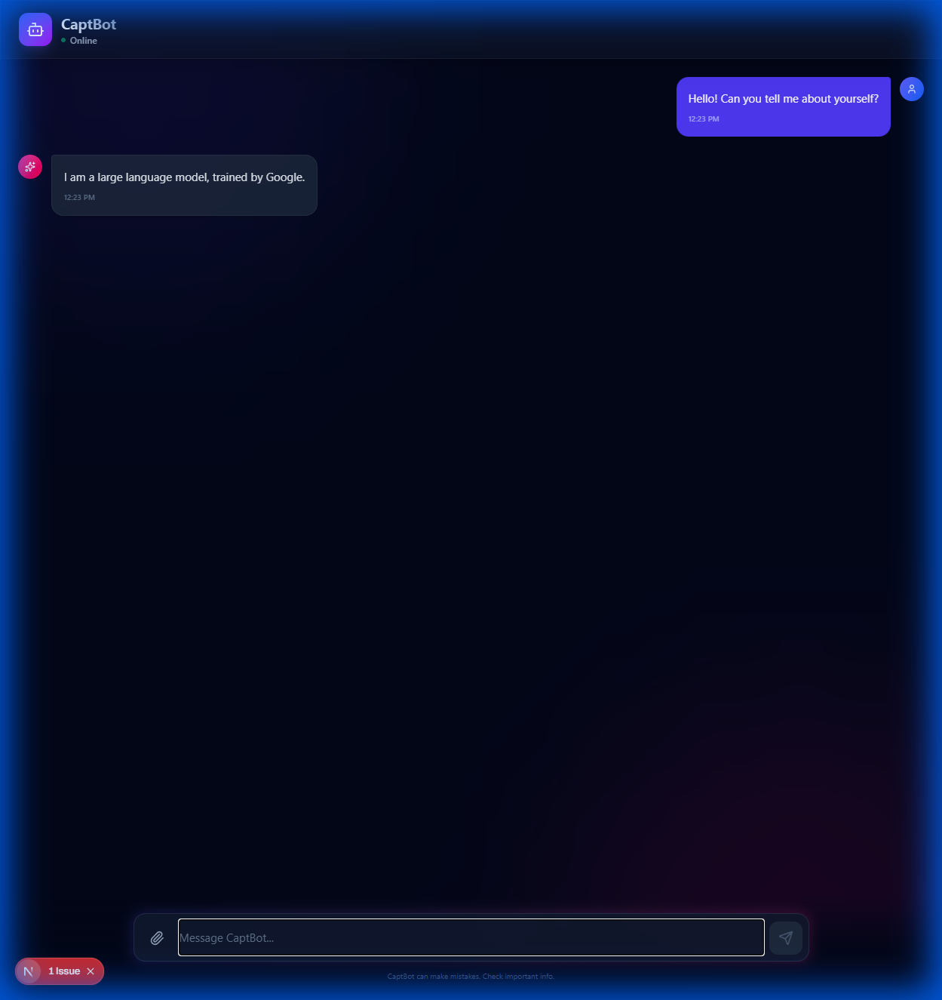

# CaptBot 🤖

An intelligent AI chatbot built with **Next.js** and **FastAPI**, powered by Google's Gemini AI. CaptBot features a modern, responsive UI with support for multimodal inputs, RAG (Retrieval-Augmented Generation), and extensible tool integration.



## ✨ Features

- **🎨 Modern UI**: Beautiful, responsive interface with glassmorphism effects and smooth animations
- **🤖 AI-Powered**: Leverages Google Gemini 2.5 Flash for intelligent responses
- **📁 Multimodal Support**: Upload and discuss images with the AI
- **🔍 RAG Integration**: Retrieval-Augmented Generation for context-aware responses
- **🛠️ Extensible Tools**: Built-in weather and web search capabilities
- **⚡ Real-time Chat**: Fast, streaming responses with typing indicators
- **🌐 Production Ready**: Environment-based configuration for easy deployment

## 🏗️ Architecture

### Frontend
- **Framework**: Next.js 16 with TypeScript
- **Styling**: Tailwind CSS with custom animations
- **UI Components**: Framer Motion for smooth transitions
- **Icons**: Lucide React

### Backend
- **Framework**: FastAPI (Python)
- **AI Model**: Google Gemini 2.5 Flash Lite
- **RAG**: LangChain with in-memory document storage
- **Tools**: LangChain tool integration

## 🚀 Getting Started

### Prerequisites

- Node.js 18+ and npm
- Python 3.8+
- Google API Key ([Get one here](https://makersuite.google.com/app/apikey))

### Installation

1. **Clone the repository**
   ```bash
   git clone https://github.com/captflag/CaptBot.git
   cd CaptBot
   ```

2. **Set up the Backend**
   ```bash
   cd backend
   pip install -r requirements.txt
   ```

3. **Configure Backend Environment**
   
   Create a `.env` file in the `backend` directory:
   ```env
   GOOGLE_API_KEY=your_google_api_key_here
   ALLOWED_ORIGINS=http://localhost:3000
   ```

4. **Set up the Frontend**
   ```bash
   cd ../frontend
   npm install
   ```

5. **Configure Frontend Environment**
   
   Create a `.env.local` file in the `frontend` directory:
   ```env
   NEXT_PUBLIC_API_URL=http://localhost:8000
   ```

### Running Locally

1. **Start the Backend** (from the `backend` directory):
   ```bash
   uvicorn main:app --reload
   ```
   The API will be available at `http://localhost:8000`

2. **Start the Frontend** (from the `frontend` directory):
   ```bash
   npm run dev
   ```
   The app will be available at `http://localhost:3000`

## 📦 Deployment

### Frontend (Vercel)

1. Push your code to GitHub
2. Import the project in Vercel
3. Set the root directory to `frontend`
4. Add environment variable:
   - `NEXT_PUBLIC_API_URL`: Your backend API URL

### Backend (Railway/Render/Fly.io)

1. Deploy the `backend` directory
2. Set environment variables:
   - `GOOGLE_API_KEY`: Your Google API key
   - `ALLOWED_ORIGINS`: Your frontend URL (e.g., `https://your-app.vercel.app`)
3. Use the start command: `uvicorn main:app --host 0.0.0.0 --port $PORT`

## 🛠️ Configuration

### Backend Environment Variables

| Variable | Description | Required |
|----------|-------------|----------|
| `GOOGLE_API_KEY` | Google Gemini API key | Yes |
| `ALLOWED_ORIGINS` | Comma-separated list of allowed CORS origins | Yes |

### Frontend Environment Variables

| Variable | Description | Required |
|----------|-------------|----------|
| `NEXT_PUBLIC_API_URL` | Backend API URL | Yes |

## 📚 API Documentation

Once the backend is running, visit `http://localhost:8000/docs` for interactive API documentation.

### Main Endpoints

- `GET /` - Health check
- `GET /health` - Detailed health status
- `POST /chat` - Send a message to the chatbot
  - **Parameters**:
    - `message` (string): User message
    - `session_id` (string): Session identifier
    - `file` (optional): Image file upload

## 🎨 Features in Detail

### RAG (Retrieval-Augmented Generation)
CaptBot uses a simple in-memory RAG system to provide context-aware responses. The system:
- Splits documents into chunks
- Performs keyword-based retrieval
- Enhances responses with relevant context

### Tool Integration
Built-in tools include:
- **Weather Tool**: Get weather information for any city
- **Web Search Tool**: Search the web for information

Add more tools by extending the `tools.py` file.

### Multimodal Support
Upload images and ask questions about them. The AI can analyze and discuss visual content.

## 🤝 Contributing

Contributions are welcome! Please feel free to submit a Pull Request.

## 📄 License

This project is open source and available under the [MIT License](LICENSE).

## 🙏 Acknowledgments

- Built with [Next.js](https://nextjs.org/)
- Powered by [Google Gemini](https://deepmind.google/technologies/gemini/)
- Backend framework: [FastAPI](https://fastapi.tiangolo.com/)
- AI orchestration: [LangChain](https://langchain.com/)

---

**Made with ❤️ by [captflag](https://github.com/captflag)**
